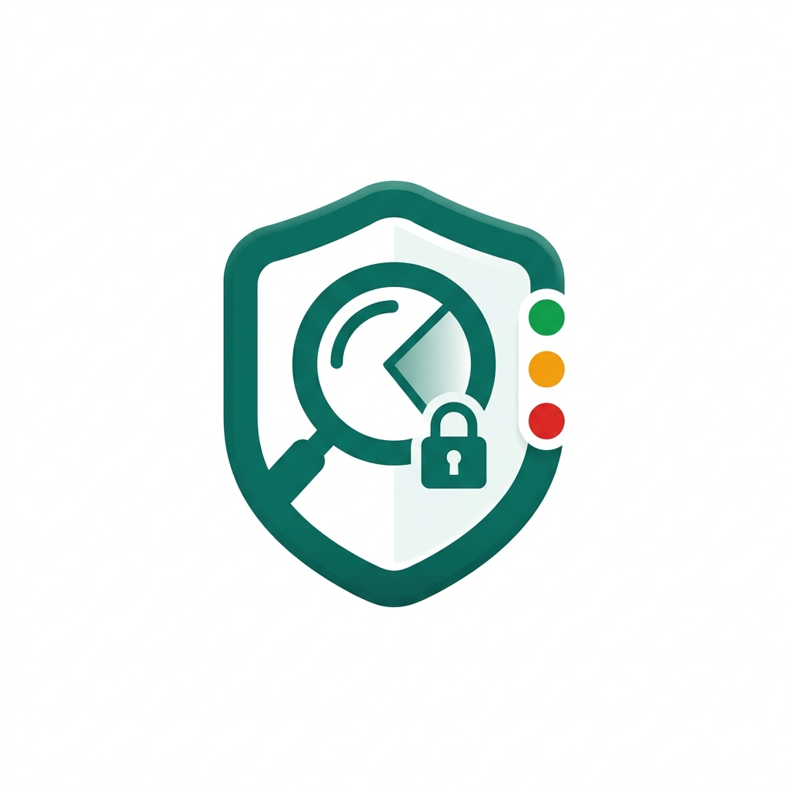

<p align="center">
  
</p>

<h1 align="center">ShieldVN</h1>

<p align="center">
  <strong>🛡️ Trợ lý AI cảnh báo & phòng chống lừa đảo trực tuyến cho người Việt</strong>
</p>

<p align="center">
  <a href="#features">Features</a> •
  <a href="#architecture">Architecture</a> •
  <a href="#tech-stack">Tech Stack</a> •
  <a href="#getting-started">Getting Started</a> •
  <a href="#roadmap">Roadmap</a> •
  <a href="#license">License</a>
</p>

<p align="center">
  
  
  
  
  
  
</p>

---

## The Problem

Online scams in Vietnam are evolving rapidly — fake VietQR bills, fraudulent recruitment schemes, spoofed QR codes, and malicious `.apk` files impersonating government apps. Existing tools require manual input of account numbers or URLs, **cannot read screenshot context**, and offer no privacy guarantees when users submit sensitive data.

## The Solution

**ShieldVN** is a **Privacy-First** AI assistant that helps Vietnamese users identify, analyze, and prevent online scams at the **"golden moment"** — right before transferring money or clicking a suspicious link.

Upload a screenshot or paste a suspicious message → get an instant **🟢 AN TOÀN / 🟡 CẨN THẬN / 🔴 NGUY HIỂM** verdict with evidence in plain Vietnamese.

> _"Số tài khoản bị strip trước khi AI thấy — Google không bao giờ nhận được."_

---

## Features

### 🔍 Multi-Modal Scam Detection
- **Screenshot analysis** — AI reads bill layouts, message context, fonts, and urgency patterns
- **Text & URL analysis** — paste suspicious messages or links for instant evaluation
- **Structured verdicts** — GREEN / YELLOW / RED with confidence score, evidence, and recommendations in Vietnamese

### 🔒 Privacy-First by Design
- **PII redaction** — phone numbers, bank accounts (STK), and ID numbers (CCCD) are stripped from text via regex **before** sending to AI
- **Image PII masking** — Tesseract OCR detects sensitive text regions in images, which are masked on the server **before** AI analysis
- **Zero-disk architecture** — all processing happens in RAM; images are never persisted

### 📊 4-Tier Blacklist System
| Tier | Source | Rule |
|------|--------|------|
| **1 — Official** | Ministry of Public Security, banks, ChongLuaDao | Auto blacklist |
| **2 — Trusted community** | High-reputation reporters | 2–3 matching reports → pending |
| **3 — Anonymous** | Anonymous reports | Pending, never labeled as "100% scam" |
| **4 — Appeals** | Falsely reported account owners | Upload proof → moderator review ≤24h |

### 📢 Viral Warning Card
- Canvas-rendered **1080×1350 PNG** optimized for social media
- Share directly to **Zalo / Facebook** via Web Share API
- Includes verdict summary, key evidence, confidence score, and QR code back to ShieldVN

### 📱 PWA & Accessibility
- Installable Progressive Web App — works in Zalo in-app browser
- Mobile-first design optimized for **older users** and less tech-savvy audiences
- Large text (17–28px), 48×48px touch targets, AA contrast compliance
- Full Vietnamese UI with plain-language explanations

---

## Architecture

```
PWA (Next.js)  — 2 screens: Upload / Result (+ Warning-card share)
        │ multipart/form-data (image) + JSON (text)
        ▼
GOLANG / Gin API   (Google Cloud Run · RAM-only · zero-disk)
  1. Text PII redact  (regex)
  2. Image PII mask   (Tesseract TSV → regex phone/STK/CCCD → bbox mask → clean JPEG)
  3. Parallel goroutines:
        (a) Gemini 2.5 Flash — vision + responseSchema
        (b) Firestore tier-lookup on extracted STK/SĐT
  4. Merge → GREEN/YELLOW/RED + evidence
        ├─► Gemini API          (clean payload only)
        └─► Firestore           (reports / 4-tier logic / moderation / appeals)
              + Google Sheet    (Tier-1 seed, read-only, judges-visible)
```

---

## Tech Stack

| Layer | Technology | Purpose |
|-------|-----------|---------|
| **Frontend** | Next.js (React) + Tailwind CSS | 2-screen PWA, client-side image compression, Risk Card & Warning Card |
| **Backend** | Go 1.22 + Gin | API routing, orchestration, PII engine |
| **AI** | Gemini 2.5 Flash (structured output) | Multi-modal scam analysis with JSON response schema |
| **PII Engine** | Go `regexp` + `image/draw` + Tesseract OCR (`vie`) | Text redaction + image region masking |
| **Database** | Cloud Firestore | Reports, 4-tier scoring, moderation queue, appeals |
| **Blacklist Seed** | Google Sheets API (read-only) | Tier-1 official blacklist — visible to judges |
| **Deployment** | Google Cloud Run | Docker multi-stage (Alpine + Tesseract + Vietnamese data), scale-to-zero |
| **Font** | Be Vietnam Pro (Google Fonts) | Optimized Vietnamese diacritics rendering |

---

## Getting Started

### Prerequisites

- **Go** ≥ 1.22
- **Node.js** ≥ 18
- **Tesseract OCR** with Vietnamese language data (`tesseract-ocr` + `tesseract-ocr-data-vie`)
- **Google Cloud** credentials (Gemini API key, Firestore service account)

### Backend

```bash
cd backend
cp .env.example .env          # Fill in: GEMINI_API_KEY, FIRESTORE creds, SHEET_ID
go mod tidy
go run ./cmd/api              # Starts on :8080
```

### Frontend

```bash
cd frontend
npm install
echo "NEXT_PUBLIC_API_URL=http://localhost:8080" > .env.local
npm run dev                   # Starts on :3000
```

### Quality Gates

```bash
# Go
go build ./...
go vet ./...
go test ./...

# Frontend
npm run build                 # TypeScript strict mode
```

---

## Project Structure

```
shieldvn/
├── backend/                      # Go (Gin) API
│   ├── cmd/api/main.go           # Entrypoint
│   ├── internal/
│   │   ├── handler/              # HTTP handlers (analyze, report, moderate, appeal)
│   │   ├── service/              # Business logic (gemini, pii, blacklist, moderation)
│   │   ├── store/                # Firestore + Sheets clients
│   │   ├── model/                # Domain structs + DTOs
│   │   └── config/               # Environment loading
│   └── Dockerfile                # Multi-stage (Alpine + Tesseract + vie)
├── frontend/                     # Next.js PWA
│   ├── app/                      # 2 routes: upload page, result page
│   ├── components/               # risk-card, evidence-list, warning-card, uploader
│   ├── lib/                      # API client, image-compress, constants
│   └── public/                   # PWA manifest, icons
├── docs/                         # Project documentation
├── plans/                        # Implementation plans & phase reports
└── .github/workflows/            # CI (lint, build)
```

---

## Roadmap

| Phase | Description | Status |
|-------|-------------|--------|
| 0 | Project skeleton + text verdict | ⬜ Pending |
| 1 | Image verdict (Gemini vision) | ⬜ Pending |
| 2 | Tier-1 blacklist lookup | ⬜ Pending |
| 3 | Text PII redaction | ⬜ Pending |
| 4 | 4-tier model + reporting | ⬜ Pending |
| 5 | Moderation + appeals | ⬜ Pending |
| 6 | Image PII masking | ⬜ Pending |
| 7 | Warning card (viral share) | ⬜ Pending |
| 8 | Deploy + polish (Cloud Run, PWA) | ⬜ Pending |
| 9 | Demo video + submission | ⬜ Pending |

> **Safe floor:** Phase 2 (~day 5) delivers a demoable core. Phases 3–9 are upside.

See [`docs/06-project-roadmap.md`](docs/06-project-roadmap.md) for the full roadmap with milestones and risk mitigations.

---

## Documentation

| Document | Description |
|----------|-------------|
| [`01-project-overview-pdr.md`](docs/01-project-overview-pdr.md) | Product Development Requirements |
| [`02-design-guidelines.md`](docs/02-design-guidelines.md) | UI/UX design system, colors, typography, components |
| [`03-system-architecture.md`](docs/03-system-architecture.md) | System architecture & data flow |
| [`04-codebase-summary.md`](docs/04-codebase-summary.md) | Codebase structure & module map |
| [`05-code-standards.md`](docs/05-code-standards.md) | Code conventions & quality gates |
| [`06-project-roadmap.md`](docs/06-project-roadmap.md) | Build phases, milestones, risks |
| [`07-deployment-guide.md`](docs/07-deployment-guide.md) | Deployment instructions |
| [`08-test-plan.md`](docs/08-test-plan.md) | Testing strategy |
| [`09-ci-pipeline.md`](docs/09-ci-pipeline.md) | CI/CD pipeline configuration |

---

## Competition

Built for **Google AI Riser Vietnam 2026** · Topic #5: Scam & Fraud · Deadline: **2026-08-30**

### Competitive Advantage

| | **ShieldVN** | **nTrust** | **ChongLuaDao.vn** |
|---|---|---|---|
| Analysis | Multi-modal AI (image + text + QR + URL) | Phone/account lookup, call blocking | Browser extension URL blocking |
| Screenshot context | **Yes** (fonts, layout, urgency cues) | No | No |
| PII protection | **Masks before sending to AI** | Depends on user input | URL-based |
| Viral sharing | **Warning card** for Zalo/Facebook | No | Bad link reports |

---

## License

This project is licensed under the **MIT License** — see the [LICENSE](LICENSE) file for details.

© 2026 Trang Nguyen
